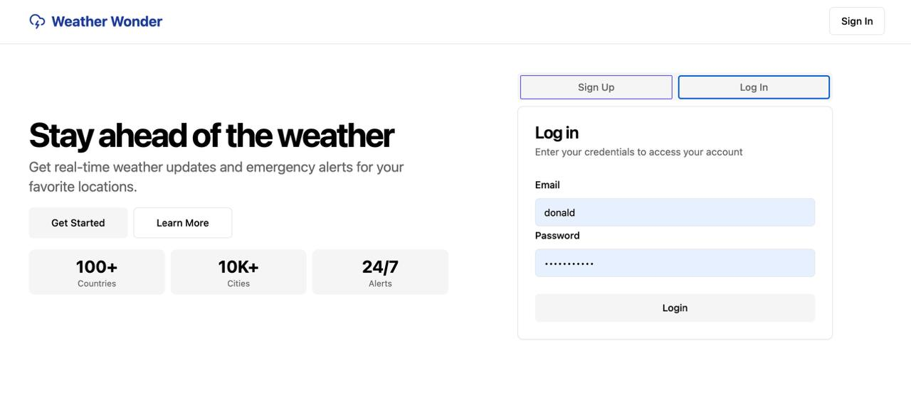

# Weather Wonder

Weather Wonder is a microservices-based application that provides weather forecasts, emergency monitoring, and notifications. It includes a backend with multiple microservices, an API gateway, and a frontend built with Next.js.

## Project Structure
```
ESD-Weather-Wonder
├── backend/ # Backend microservices 
├── api_gateway/ # API Gateway configuration 
├── frontend/ # Frontend application 
├── run.sh # Script to start all services (Linux/Mac) 
├── run.bat # Script to start all services (Windows) 
├── down.sh # Script to stop all services (Linux/Mac) 
├── down.bat # Script to stop all services (Windows) 
├── .gitignore # Git ignore file 
├── package.json # Project dependencies 
├── package-lock.json # Dependency lock file 
└── README.md # Project documentation
```

## Prerequisites

- Docker and Docker Compose
- Node.js (v16 or later)
- npm or yarn

## Setting Up the Project

### 1. Clone the Repository
```
bash
git clone https://github.com/your-username/ESD-Weather-Wonder.git
cd ESD-Weather-Wonder
```

### 2. Install frontend dependencies
```
cd frontend
npm install
cd ../
```

### 3. Configure environment variables
The project requires several .env files for different services. 
Below are the required .env files and their configurations:
* For instructor use: Please refer to the secrets.txt file attached with the project submission for the environment variables.

#### Backend Microservices
Notification Service (backend/notification/src/main/resources/.env):
```
EMAIL_USERNAME=your_email_username
EMAIL_PASSWORD=your_email_password
RABBITMQ_HOST=rabbitmq
```
---
Weather Wrapper Service (backend/weather/src/main/resources/.env):
```
WEATHERAPI_KEY=your_weather_api_key
```
---
Emergency Monitoring Service (backend/emergency_monitoring/src/main/resources/.env):
```
WEATHER_WRAPPER_URL=http://weather:8081
USER_MS_URL=http://user:5001
RABBITMQ_HOST=rabbitmq
```
---
User Service (backend/user/.env):
```
SUPABASE_URL=your_supabase_url
SUPABASE_KEY=your_supabase_key
```
---
Location Weather Service (backend/location_weather/.env):
```
SUPABASE_URL=your_supabase_url
SUPABASE_KEY=your_supabase_key
```

#### API Gateway
API Gateway (api_gateway/.env):
```
KONG_DATABASE=off
KONG_DECLARATIVE_CONFIG=/usr/local/kong/declarative/gateway.yaml
```

#### Frontend
Frontend (frontend/.env):
```
NEXT_PUBLIC_API_KEY_NAME=weatherwonderapi_key
NEXT_PUBLIC_API_KEY_VALUE=abc123xyz
```

### 4. Start the services
For Linux/Mac Users
```
# To start the services:
run.sh

# To stop the services:
down.sh
```
For Windows Users
```
# To start the services:
run.bat

# To stop the services:
down.bat
```